# GCP - Associate Cloud Engineer

## Contents

- [Authentication & Authorization in Google Cloud with Cloud IAM](#authentication--authorization-in-google-could-with-cloud-iam)

    - [Introduction](#introduction)

    - [Exploring Cloud IAM Roles](#exploring-cloud-iam-roles)

    - [Playing with IAM Roles - Predefined, Basic and Custom Roles](#playing-with-iam-roles---predefined-basic-and-custom-roles)

    - [Exploring Cloud IAM - Members, Role and Policy](#exploring-cloud-iam---members-role-and-policy)

    - [Demo - Playing with IAM (DIY)](#demo---playing-with-iam-diy)

    - [Getting started with Service Accounts](#getting-started-with-service-accounts)

    - [Demo - Playing with Service Accounts](#demo---playing-with-service-accounts)

    - [Exploring Service Account Use Cases](#exploring-service-account-use-cases)

    - [Scenarios - Service Accounts](#scenarios---service-accounts)

    - [ACL(Access Control Lists)](#aclaccess-control-lists)

    - [Signed URLs - Part of Cloud Storage](#signed-urls---part-of-cloud-storage)

    - [Exposing a Public Website using Cloud Storage](#exposing-a-public-website-using-cloud-storage)

## Authentication & Authorization in Google Could with Cloud IAM

### Introduction

- You have resources in the cloud (examples, a virtual server, a database etc).

- You have identities (human and non-human) that need to access those resources and perform actions​.

    - for eg., start, stop or terminate a virtual server

- How do you identify users in the cloud?​

    - How do you configure resources they can access?​

    - How can you configure what actions to allow?

- ***In GCP, Identity and Access Management (Cloud IAM) provides  this service***

    - Authentication - Is it the right user?

    - Authorization - Do they have the right access?

    - Identities can be:

        - A GCP User (Google Account or Externally Authenticated User)​

        - A Group of GCP Users​

        - An Application running in GCP​

        - An Application running in your data center

        - Unauthenticated users​

    - Provides very granular control:

        - Provides very ***granular*** control,

            - to perform single action

            - on a specific cloud resource

            - from a specific IP address

            - during a specific time window

<strong><ins>Example</ins><strong>

***Scenario***

I want to provide access to manage a specific cloud storage bucket to a colleague of mine.

Important generic concepts:

- Member: My colleague​

- Resource: Specific cloud storage bucket​

- Action: Upload/Delete Objects​

In Google Cloud IAM,

- Roles are set of permissions to perform specific actions on specific resources.

    - Roles do *NOT* know about members. It is all about permissions.

- How do you assign permissions to a member?​
    - By using **Policy**. In policy, you assign (or bind) a role to a member​.

***Solution***

- Choose a *Role* with right permissions (Ex: Storage Object Admin).

- Create policy which binds the member with that *Role*.

> Note
>
> IAM in AWS is very different from GCP.

Readings:

- [Google Cloud IAM and AWS IAM](https://blog.devgenius.io/google-cloud-iam-and-aws-iam-similarities-and-differences-442f2e13835)

### Exploring Cloud IAM Roles

- Roles are permissions:

    - Perform some set of actions on some set of resources​.

- There are 3 types of roles:

    - **Basic Roles (or Primitive roles)** - Owner/Editor/Viewer​

        - Viewer(roles.viewer) - Read-only actions​

        - Editor(roles.editor) - Viewer + Edit actions​

        - Owner(roles.owner) - Editor + Manage Roles and Permissions + Billing
        
        - ***Basic roles are earliest version and not recommended to use in production***
    
    - **Predefined Roles** - Fine grained roles predefined and managed by Google​.

        - Different roles for different purposes​, for examples, Storage Admin, Storage Object Admin, Storage Object Viewer, Storage Object Creator

    - **Custom Roles** - When predefined roles are NOT sufficient, you can create your own custom roles

Readings:

- [Understanding GCP IAM Roles](https://www.strongdm.com/blog/gcp-iam-roles)
- [IAM basic and predefined roles reference - Official Docs](https://cloud.google.com/iam/docs/understanding-roles)

### Playing with IAM Roles - Predefined, Basic and Custom Roles

Let's play with roles. For that, type roles in search bar and press enter. You will be presented with varieties of roles available in GCP. Let's see one role of each category.

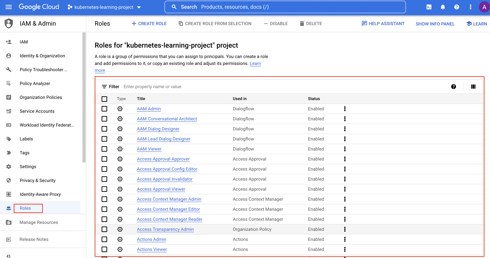

**1. Basic Roles**

In filter, type ```Name:roles/viewer``` and you will see more than 2000 permissions are associated with this role. Analyze all such permissions associated with it.

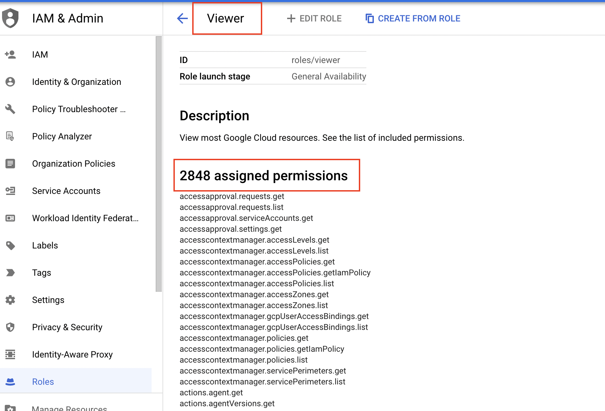

**2. Predefined Roles**

In filter, type ```Storage Admin Object``` and you will see more than 10 permissions are associated with this role. Analyze all such permissions associated with it.

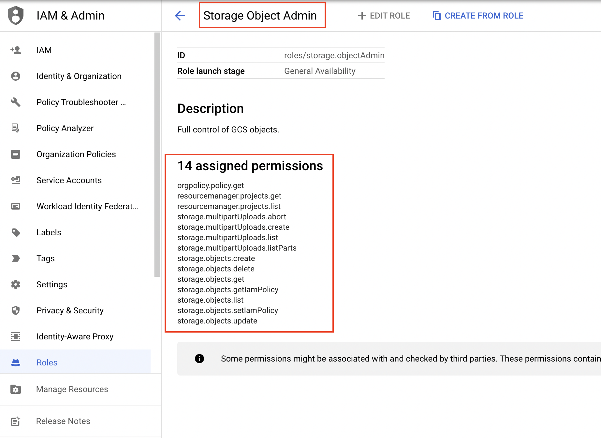

**3. Custom Roles**

Follow [this link](https://docs.cloudera.com/cdp-private-cloud-base/7.1.3/cloud-data-access/topics/cr-cda-create-custom-role-gcs.html) to know how to create custom roles.

### Exploring Cloud IAM - Members, Role and Policy

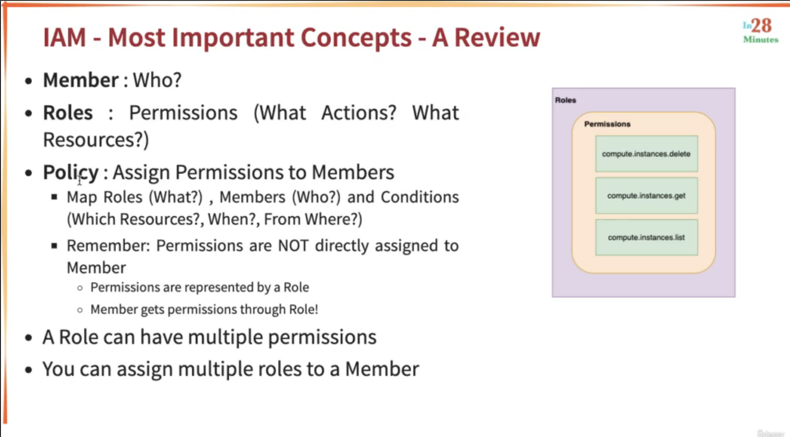

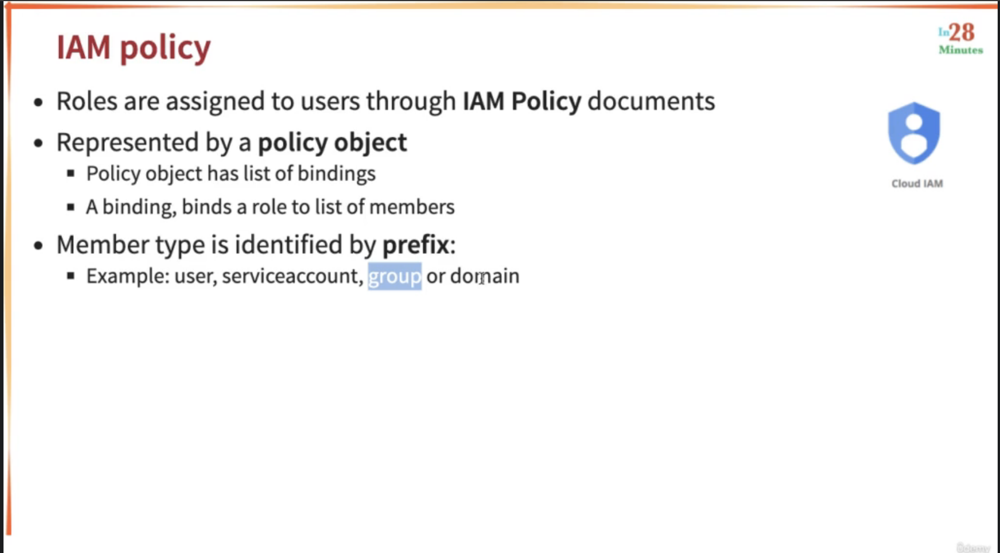

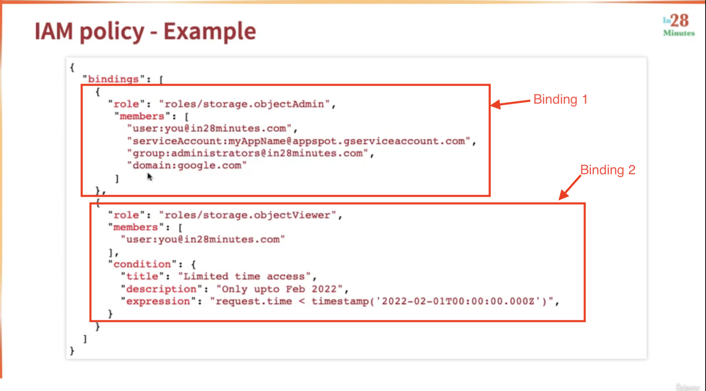

### Demo - Playing with IAM (DIY)

<ins><strong>GUI</strong></ins>

Below things are covered in this demo:

- In search bar, type **IAM** and try adding a new member, modify present member roles.

- Checkout **Policy Troubleshooter**.

<ins><strong>CLI</strong></ins>

Below are few important commands used to perform IAM related tasks:

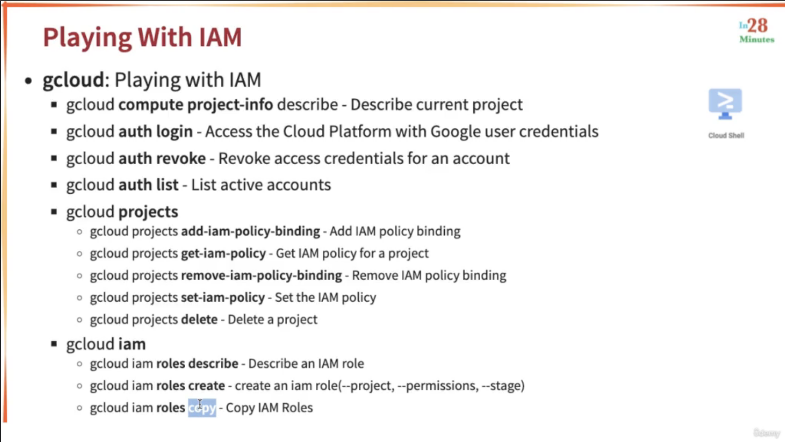

### Getting started with Service Accounts

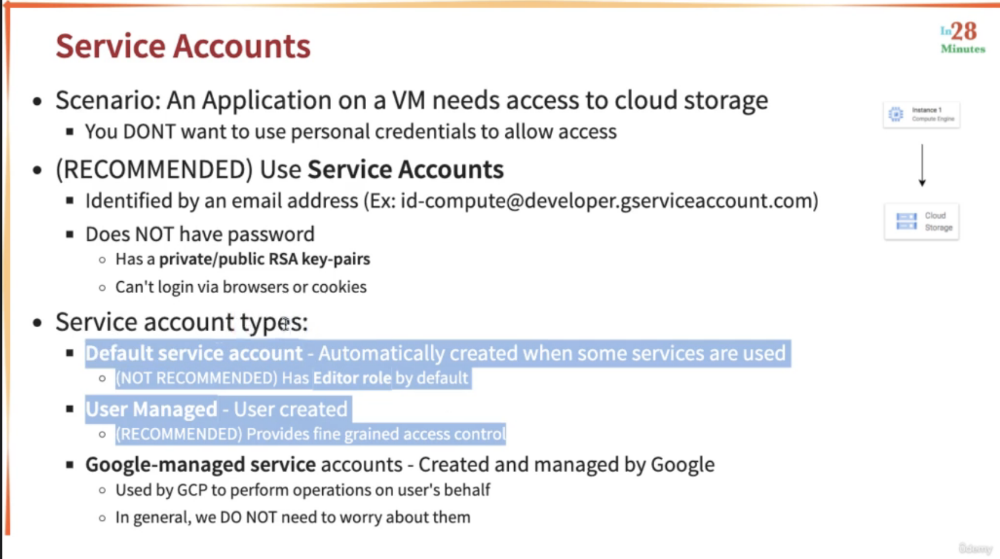

Readings:

- [How to create a service account in the GCP console?](https://support.site24x7.com/portal/en/kb/articles/how-to-create-a-service-account-in-gcp-console)

### Demo - Playing with Service Accounts

**Scenario**

An application is running on VM and we want to give this VM access to create cloud storage bucket.

**Solution**

- Create a service account with role ***Compute Instance Admin*** & ***Storage Admin*** and add users to grant access of this service account if required.

- Create a VM and add this service account.

### Exploring Service Account Use Cases

**Use Case 1 - VM using Cloud Storage**

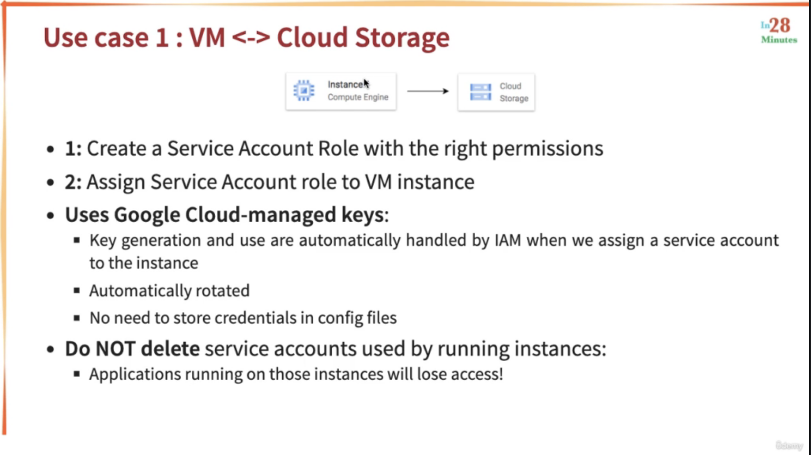

**Use Case 2 - Connect on premises machine to cloud storage**

Until now, we have been talking about resources which are present in Google Cloud. Now, let's suppose there is a server present outside GCP.

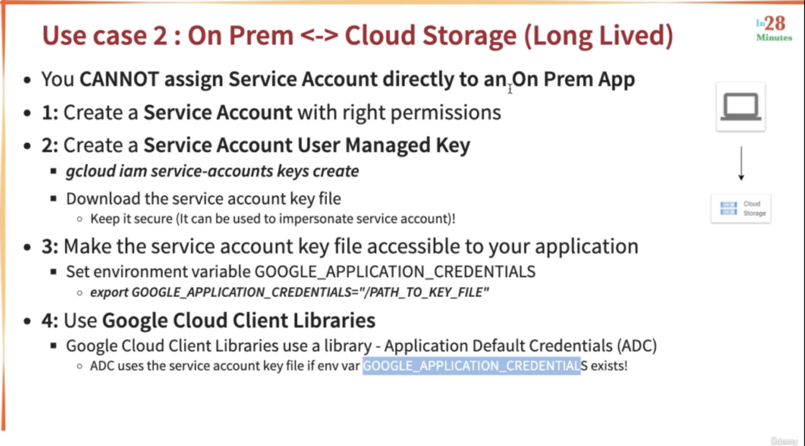

**Use Case 3 - Connect on premises machine to cloud storage but for few hours**

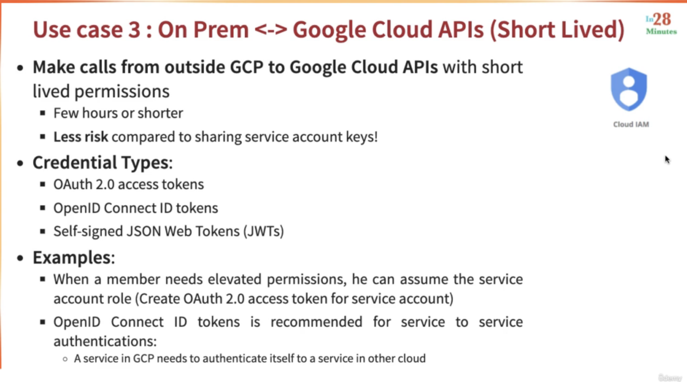

### Scenarios - Service Accounts

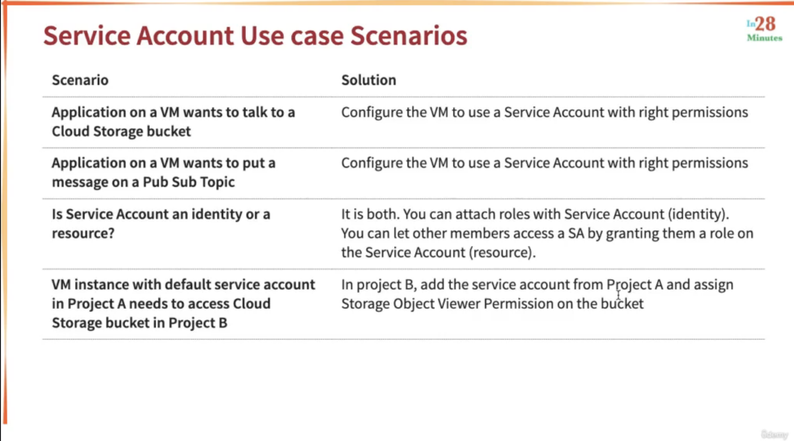

### ACL(Access Control Lists) - Part of Cloud Storage

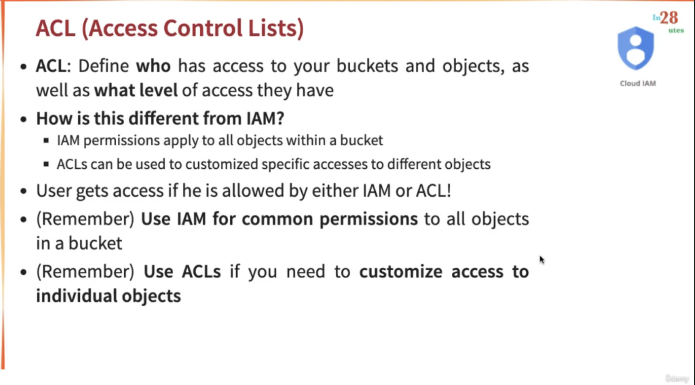

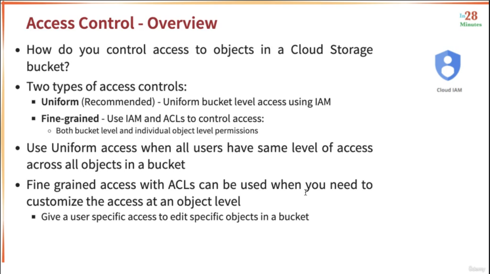

Readings:

- [Access control lists (ACLs) - Official Docs](https://cloud.google.com/storage/docs/access-control/lists)

### Signed URLs - Part of Cloud Storage

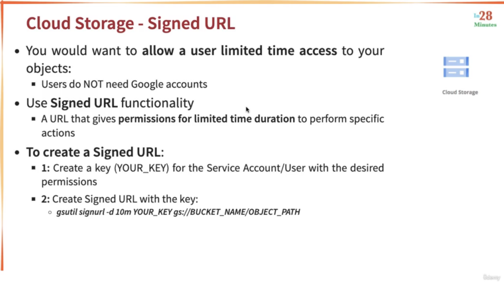

Readings:

- [Signed URLs - Official Docs](https://cloud.google.com/storage/docs/access-control/signed-urls)

### Exposing a Public Website using Cloud Storage

Suppose, you want to expose buckets, let's say, in a public website, then below are the steps to do so:

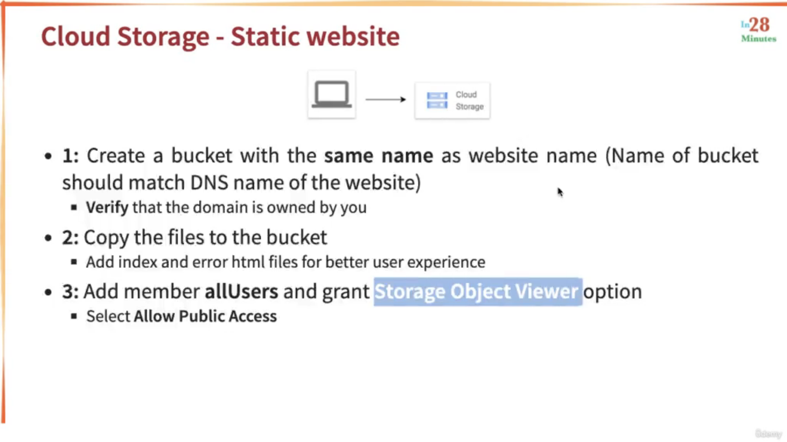

Readings:

- [Make Data Public - Official Docs](https://cloud.google.com/storage/docs/access-control/making-data-public)

## References

- [GCP Associate Cloud Engineer - Google Cloud Certification -  in28Minutes Official, Ranga Karanam | GCP Certification - Google Cloud Engineer & Architect](https://www.udemy.com/course/google-cloud-certification-associate-cloud-engineer/)