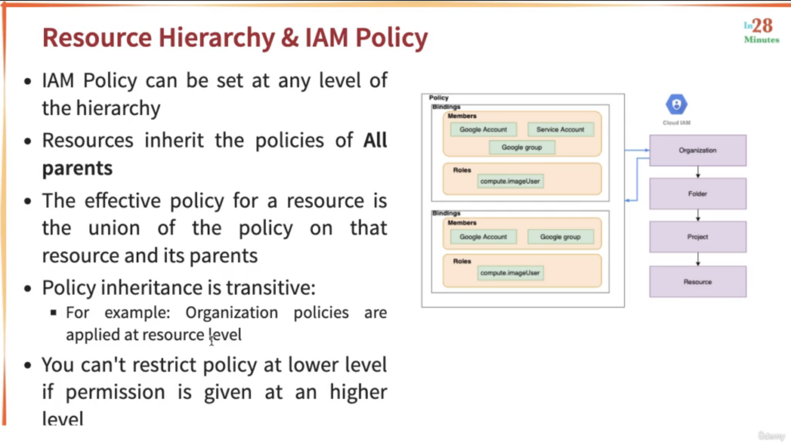

# GCP - Associate Cloud Engineer

## Contents

- [Authentication & Authorization in Google Cloud with Cloud IAM](#authentication--authorization-in-google-could-with-cloud-iam)

    - [Introduction](#introduction)

    - [Exploring Cloud IAM Roles](#exploring-cloud-iam-roles)

    - [Playing with IAM Roles - Predefined, Basic and Custom Roles](#playing-with-iam-roles---predefined-basic-and-custom-roles)

    - [Exploring Cloud IAM - Members, Role and Policy](#exploring-cloud-iam---members-role-and-policy)

    - [Demo - Playing with IAM (DIY)](#demo---playing-with-iam-diy)

    - [Getting started with Service Accounts](#getting-started-with-service-accounts)

    - [Demo - Playing with Service Accounts](#demo---playing-with-service-accounts)

    - [Exploring Service Account Use Cases](#exploring-service-account-use-cases)

    - [Scenarios - Service Accounts](#scenarios---service-accounts)

    - [ACL(Access Control Lists)](#aclaccess-control-lists)

    - [Signed URLs - Part of Cloud Storage](#signed-urls---part-of-cloud-storage)

    - [Exposing a Public Website using Cloud Storage](#exposing-a-public-website-using-cloud-storage)

- [Asynchronous Communication in Google Cloud with Cloud Pub Sub](#asynchronous-communication-in-google-cloud-with-cloud-pub-sub)

    - [Understanding the need for Asynchronous Communication](#understanding-the-need-for-asynchronous-communication)

    - [Getting Started with Cloud Pub Sub](#getting-started-with-cloud-pub-sub)

    - [Exploring Cloud Pub Sub - Publishing and Consuming a Message](#exploring-cloud-pub-sub---publishing-and-consuming-a-message)

    - [Demo - Playing with Pub/Sub](#demo---playing-with-pubsub)

- [Private Networks in Google Cloud - Cloud VPC](#private-networks-in-google-cloud---cloud-vpc)

    - [Understanding the need for Google Cloud VPC - Virtual Private Cloud](#understanding-the-need-for-google-cloud-vpc---virtual-private-cloud)

    - [Understanding the need for VPC subnets](#understanding-the-need-for-vpc-subnets)

    - [Creating VPCs and Subnets in GCP](#creating-vpcs-and-subnets-in-gcp)

    - [Understanding Firewall Rules in GCP](#understanding-firewall-rules-in-gcp)

    - [Getting Started with Shared VPC](#getting-started-with-shared-vpc)

    - [Getting Started with VPC Peering](#getting-started-with-vpc-peering)

    - [Implementing Hybrid Cloud with Cloud VPN and Cloud Interconnect](#implementing-hybrid-cloud-with-cloud-vpn-and-cloud-interconnect)

- [Operations in Google Cloud Platform](#operations-in-google-cloud-platform)

    - [Getting Started with Google Cloud Monitoring](#getting-started-with-google-cloud-monitoring)

    - [Getting Started with Google Cloud Logging](#getting-started-with-google-cloud-logging)

    - [Exploring Google Cloud Logging - Audit Logs](#exploring-google-cloud-logging---audit-logs)

    - [Exploring Google Cloud Logging - Routing Logs and Exports](#exploring-google-cloud-logging---routing-logs-and-exports)

    - [Creating a Cloud Storage Bucket and Cloud Function](#creating-a-cloud-storage-bucket-and-cloud-function)

    - [Getting Started with Google Cloud Trace](#getting-started-with-google-cloud-trace)

    - [Getting Started with Google Cloud Debugger](#getting-started-with-google-cloud-debugger)

    - [Cloud Profiler and Error Reporting](#cloud-profiler-and-error-reporting)

    - [Scenarios - Operations in GCP](#scenarios---operations-in-gcp)

- [Organizations and IAM - Organizing Google Cloud Resources](#organizations-and-iam---organizing-google-cloud-resources)

    - [Organizing Google Cloud Resources - Projects, Folders and Organization](#organizing-google-cloud-resources---projects-folders-and-organization)

    - [Exploring Billing Accounts](#exploring-billing-accounts)

    - [Understanding IAM Best Practice](#understanding-iam-best-practice)

    - [Understanding User Identity Management in GCP](#understanding-user-identity-management-in-gcp)

    - [Exploring IAM Members and Identities](#exploring-iam-members-and-identities)

    - [Understanding Organization Policy Service](#understanding-organization-policy-service)

    - [Exploring IAM policy at multiple levels - Resource Hierarchy](#exploring-iam-policy-at-multiple-levels---resource-hierarchy)

    - [Exploring IAM Predefined Roles - Organization, Billing and Project](#exploring-iam-predefined-roles---organization-billing-and-project)

    - [Exploring IAM Predefined Roles - Google Compute Engine](#exploring-iam-predefined-roles---google-compute-engine)

    - [Exploring IAM Predefined Roles - Google App Engine](#exploring-iam-predefined-roles---google-app-engine)

    - [Exploring IAM Predefined Roles - Scenarios](#exploring-iam-predefined-roles---scenarios)

    - [Exploring IAM Predefined Roles - Google Kubernetes Engine](#exploring-iam-predefined-roles---google-kubernetes-engine)

    - [Exploring IAM Predefined Roles - Google Cloud Storage](#exploring-iam-predefined-roles---google-cloud-storage)

    - [Exploring IAM Predefined Roles - Google Cloud BigQuery](#exploring-iam-predefined-roles---google-cloud-bigquery)

    - [Exploring IAM Predefined Roles - Logging Service Accounts](#exploring-iam-predefined-roles---logging-service-accounts)

    - [Other Important IAM Roles](#other-important-iam-roles)

    - [SSHing into Linux VMs](#sshing-into-linux-vms)

    - [Exploring IAM Scenarios](#exploring-iam-scenarios)

- [Exploring Google Cloud Platform - GCP - Pricing Calculator](#exploring-google-cloud-platform---gcp---pricing-calculator)

- [Google Cloud Platform - Other Important Services](#google-cloud-platform---other-important-services)

    - [Getting Started with Cloud Deployment Manager](#getting-started-with-cloud-deployment-manager)

    - [Understanding Cloud Deployment Manager](#understanding-cloud-deployment-manager)

    - [Getting Started with Cloud Marketplace](#getting-started-with-cloud-marketplace)

    - [Getting Started with Cloud DNS](#getting-started-with-cloud-dns)

    - [Getting Started with Cloud Dataflow](#getting-started-with-cloud-dataflow)

    - [Getting Started with Cloud Dataproc](#getting-started-with-cloud-dataproc)

- [References](#references)

## Authentication & Authorization in Google Could with Cloud IAM

### Introduction

- You have resources in the cloud (examples, a virtual server, a database etc).

- You have identities (human and non-human) that need to access those resources and perform actions​.

    - for eg., start, stop or terminate a virtual server

- How do you identify users in the cloud?​

    - How do you configure resources they can access?​

    - How can you configure what actions to allow?

- ***In GCP, Identity and Access Management (Cloud IAM) provides  this service***

    - Authentication - Is it the right user?

    - Authorization - Do they have the right access?

    - Identities can be:

        - A GCP User (Google Account or Externally Authenticated User)​

        - A Group of GCP Users​

        - An Application running in GCP​

        - An Application running in your data center

        - Unauthenticated users​

    - Provides very granular control:

        - Provides very ***granular*** control,

            - to perform single action

            - on a specific cloud resource

            - from a specific IP address

            - during a specific time window

***Scenario***

I want to provide access to manage a specific cloud storage bucket to a colleague of mine.

Important generic concepts:

- Member: My colleague​

- Resource: Specific cloud storage bucket​

- Action: Upload/Delete Objects​

In Google Cloud IAM,

- Roles are set of permissions to perform specific actions on specific resources.

    - Roles do *NOT* know about members. It is all about permissions.

- How do you assign permissions to a member?​
    - By using **Policy**. In policy, you assign (or bind) a role to a member​.

***Solution***

- Choose a *Role* with right permissions (Ex: Storage Object Admin).

- Create policy which binds the member with that *Role*.

> Note
>
> IAM in AWS is very different from GCP.

Readings:

- [Google Cloud IAM and AWS IAM](https://blog.devgenius.io/google-cloud-iam-and-aws-iam-similarities-and-differences-442f2e13835)

### Exploring Cloud IAM Roles

- Roles are permissions:

    - Perform some set of actions on some set of resources​.

- There are 3 types of roles:

    - **Basic Roles (or Primitive roles)** - Owner/Editor/Viewer​

        - Viewer(roles.viewer) - Read-only actions​

        - Editor(roles.editor) - Viewer + Edit actions​

        - Owner(roles.owner) - Editor + Manage Roles and Permissions + Billing
        
        - ***Basic roles are earliest version and not recommended to use in production***
    
    - **Predefined Roles** - Fine grained roles predefined and managed by Google​.

        - Different roles for different purposes​, for examples, Storage Admin, Storage Object Admin, Storage Object Viewer, Storage Object Creator

    - **Custom Roles** - When predefined roles are NOT sufficient, you can create your own custom roles

Readings:

- [Understanding GCP IAM Roles](https://www.strongdm.com/blog/gcp-iam-roles)
- [IAM basic and predefined roles reference - Official Docs](https://cloud.google.com/iam/docs/understanding-roles)

### Playing with IAM Roles - Predefined, Basic and Custom Roles

Let's play with roles. For that, type roles in search bar and press enter. You will be presented with varieties of roles available in GCP. Let's see one role of each category.


**1. Basic Roles**

In filter, type ```Name:roles/viewer``` and you will see more than 2000 permissions are associated with this role. Analyze all such permissions associated with it.


**2. Predefined Roles**

In filter, type ```Storage Admin Object``` and you will see more than 10 permissions are associated with this role. Analyze all such permissions associated with it.


**3. Custom Roles**

Follow [this link](https://docs.cloudera.com/cdp-private-cloud-base/7.1.3/cloud-data-access/topics/cr-cda-create-custom-role-gcs.html) to know how to create custom roles.

### Exploring Cloud IAM - Members, Role and Policy


### Demo - Playing with IAM (DIY)

<ins><strong>GUI</strong></ins>

Below things are covered in this demo:

- In search bar, type **IAM** and try adding a new member, modify present member roles.

- Checkout **Policy Troubleshooter**.

<ins><strong>CLI</strong></ins>

Below are few important commands used to perform IAM related tasks:


### Getting started with Service Accounts


Readings:

- [How to create a service account in the GCP console?](https://support.site24x7.com/portal/en/kb/articles/how-to-create-a-service-account-in-gcp-console)

### Demo - Playing with Service Accounts

**Scenario**

An application is running on VM and we want to give this VM access to create cloud storage bucket.

**Solution**

- Create a service account with role ***Compute Instance Admin*** & ***Storage Admin*** and add users to grant access of this service account if required.

- Create a VM and add this service account.

### Exploring Service Account Use Cases

**Use Case 1 - VM using Cloud Storage**


**Use Case 2 - Connect on premises machine to cloud storage**

Until now, we have been talking about resources which are present in Google Cloud. Now, let's suppose there is a server present outside GCP.


**Use Case 3 - Connect on premises machine to cloud storage but for few hours**


### Scenarios - Service Accounts


### ACL(Access Control Lists) - Part of Cloud Storage


Readings:

- [Access control lists (ACLs) - Official Docs](https://cloud.google.com/storage/docs/access-control/lists)

### Signed URLs - Part of Cloud Storage


Readings:

- [Signed URLs - Official Docs](https://cloud.google.com/storage/docs/access-control/signed-urls)

### Exposing a Public Website using Cloud Storage

Suppose, you want to expose buckets, let's say, in a public website, then below are the steps to do so:


Readings:

- [Make Data Public - Official Docs](https://cloud.google.com/storage/docs/access-control/making-data-public)

## Asynchronous Communication in Google Cloud with Cloud Pub Sub

### Understanding the need for Asynchronous Communication


Readings:

- [Asynchronous Communication — Methods and Strategies](https://dzone.com/articles/asynchronous-communication-methods-and-strategies#:~:text=The%20biggest%20benefit%20of%20asynchronous,also%20lead%20to%20better%20scalability.)
- [Understanding Synchronous and Asynchronous Communication](https://www.microfocus.com/documentation/silk-performer/205/en/silkperformer-205-webhelp-en/GUID-6CC17B5B-71B7-4703-B9E6-C81835A5335A.html)

### Getting Started with Cloud Pub Sub


Readings:

- [What is Pub/Sub?](https://cloud.google.com/pubsub/docs/overview)
- [Google Cloud Pub/Sub – Asynchronous Messaging Service](https://k21academy.com/google-cloud/google-cloud-pub-sub/)

### Exploring Cloud Pub Sub - Publishing and Consuming a Message


### Demo - Playing with Pub/Sub

**[Pub/Sub Demo](https://www.youtube.com/watch?v=f5DOsB7Nlw0&list=PLIivdWyY5sqKwVLe4BLJ-vlh9r9zCdOse&index=3)**


***Few Commands for Reference***

```
> gcloud config set project <project_name>

> gcloud pubsub topics create <topic_name>

> gcloud pubsub subscriptions create <subscription_name> --topic=<topic_name>

> gcloud pubsub topics publish <topic_name> --message=<message_content>

> gcloud pubsub subscriptions pull <subscription_name>

> gcloud pubsub subscriptions pull <subscription_name> --auto-ack

> gcloud pubsub topics list

> gcloud pubsub topics delete <topic_name>

> gcloud pubsub topics list-subscriptions <topic_name>
```

## Private Networks in Google Cloud - Cloud VPC

### Understanding the need for Google Cloud VPC - Virtual Private Cloud


Readings:

- [Google Cloud VPC (Virtual Private Cloud) for Beginners - K21Academy](https://k21academy.com/google-cloud/google-cloud-vpc/)

### Understanding the need for VPC subnets


Readings:

- [Subnet Mask - Explained (YouTube)](https://www.youtube.com/watch?v=s_Ntt6eTn94)
- [Subnetting in Networking | Subnetting Examples](https://www.gatevidyalay.com/subnetting-ip-subnetting-examples/)

### Creating VPCs and Subnets in GCP


Follow below links to see the creation of VPCs in GCP

- [How to Create VPC (Virtual Private Cloud) Network in GCP - linuxtechi](https://www.linuxtechi.com/create-vpc-network-in-gcp-google-cloud/)
- [VPC Creation on Google Cloud Platform(GCP) - Medium](https://medium.com/petabytz/vpc-creation-on-google-cloud-platform-gcp-67fa397c1106)

Readings:

- [CIDR Range Visualizer](https://cidr.xyz/)

### Understanding Firewall Rules in GCP


### Getting Started with Shared VPC


### Getting Started with VPC Peering


### Implementing Hybrid Cloud with Cloud VPN and Cloud Interconnect


Readings:

- [Configuring a Shared VPC on GCP - VMware Tanzu Docs](https://docs.pivotal.io/ops-manager/2-10/install/gcp-shared-vpc.html)

## Operations in Google Cloud Platform

In this section, let's look at how you can perform operations in the cloud. Developing applications is important.
However, maintaining applications and maintaining them in production is very important as well. That's where monitoring, logging, tracing, debugging, and all these kind of things become really, really important.

### Getting Started with Google Cloud Monitoring


Readings:

- [Getting started with Cloud Monitoring](https://www.youtube.com/watch?v=wY8cmFY4ua8)

### Getting Started with Google Cloud Logging


### Exploring Google Cloud Logging - Audit Logs


### Exploring Google Cloud Logging - Routing Logs and Exports


Readings:

- [Understand your services with Cloud Logging](https://www.youtube.com/watch?v=IlUCyV8mcS0)

### Creating a Cloud Storage Bucket and Cloud Function

This is a practice section where you need to create a bucket and then associate a cloud function to it which will be triggered as soon as any object is uploaded to this bucket. In this cloud function you can do implement anything which generates a log when an object is uploaded to bucket.

The whole purpose of this exercise is to demonstrate the cloud logging.

### Getting Started with Google Cloud Trace


Readings:

- [Cloud Trace - GCP](https://cloud.google.com/trace#:~:text=Cloud%20Trace%20is%20a%20distributed,near%20real%2Dtime%20performance%20insights.)

### Getting Started with Google Cloud Debugger


### Cloud Profiler and Error Reporting


### Scenarios - Operations in GCP


## Organizations and IAM - Organizing Google Cloud Resources

### Organizing Google Cloud Resources - Projects, Folders and Organization


> Note
>
> In a free tier, we don't have organization and folders. We directly create projects.

Readings:

- [Resource hierarchy - Official Docs](https://cloud.google.com/resource-manager/docs/cloud-platform-resource-hierarchy)

### Exploring Billing Accounts


### Understanding IAM Best Practice


### Understanding User Identity Management in GCP


### Exploring IAM Members and Identities

Let's look at different types of IAM Members or Identities:


Readings:

- [Overview of Cloud Identity](https://cloud.google.com/identity/docs/overview)
- [Single Sign-on vs. Federated Identity Management](https://www.pingidentity.com/en/resources/blog/post/sso-vs-federated-identity-management.html#:~:text=Federated%20identity%20management%2C%20also%20known,and%20authenticate%20users%20across%20domains.)

### Understanding Organization Policy Service


> Note
>
> Organization policy always overrides whatever is configured in IAM. So, if an organization policy prohibits the creation of resources in, let's say, a specific region even though a user might have that access through IAM, he will not able to create the resource in that specific region because Organization policy has the highest priority.

### Exploring IAM policy at multiple levels - Resource Hierarchy



Readings:

- [What is Identity and Access Management in Google Cloud?](https://www.educative.io/answers/what-is-identity-and-access-management-in-google-cloud)

### Exploring IAM Predefined Roles - Organization, Billing and Project


### Exploring IAM Predefined Roles - Google Compute Engine


### Exploring IAM Predefined Roles - Google App Engine


### Exploring IAM Predefined Roles - Scenarios


### Exploring IAM Predefined Roles - Google Kubernetes Engine


### Exploring IAM Predefined Roles - Google Cloud Storage


### Exploring IAM Predefined Roles - Google Cloud BigQuery


### Exploring IAM Predefined Roles - Logging Service Accounts


### Other Important IAM Roles


### SSHing into Linux VMs


### Exploring IAM Scenarios


## Exploring Google Cloud Platform - GCP - Pricing Calculator


Click here to access [Google Price Calculator](https://cloud.google.com/products/calculator).

## Google Cloud Platform - Other Important Services

### Getting Started with Cloud Deployment Manager


### Understanding Cloud Deployment Manager


### Getting Started with Cloud Marketplace


### Getting Started with Cloud DNS


### Getting Started with Cloud Dataflow


Readings:

- [Google Cloud Dataflow](https://www.zuar.com/blog/what-is-google-cloud-dataflow/)

### Getting Started with Cloud Dataproc


Readings:

- [What is Dataproc?](https://cloud.google.com/dataproc/docs/concepts/overview#:~:text=Dataproc%20is%20a%20managed%20Spark,you%20don't%20need%20them.)

## References

- [GCP Associate Cloud Engineer - Google Cloud Certification - in28Minutes Official, Ranga Karanam | GCP Certification - Google Cloud Engineer & Architect](https://www.udemy.com/course/google-cloud-certification-associate-cloud-engineer/)